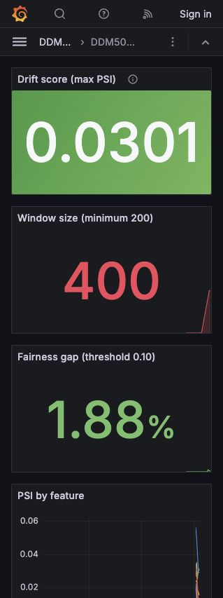
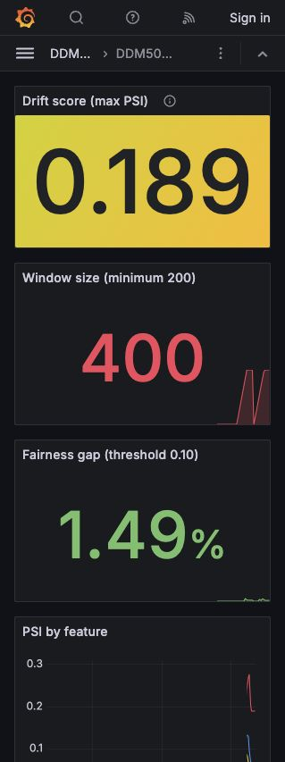
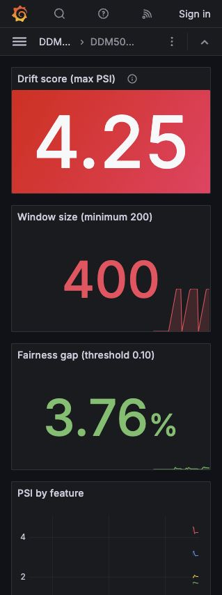
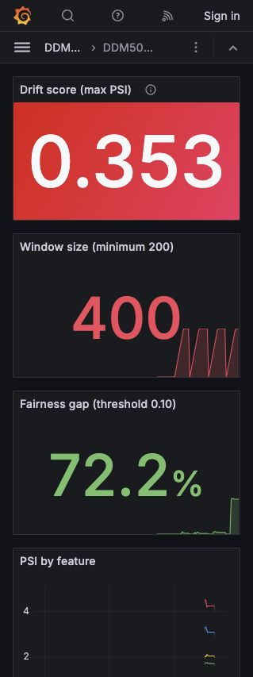
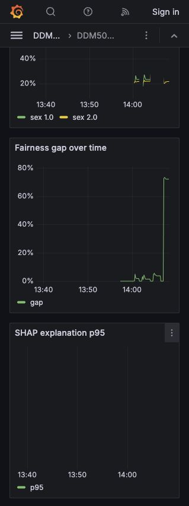

# Lab 4 - Giám sát và triển khai hệ thống ML

DDM501 | GitHub: thanhhai12 | Ngày thực nghiệm: 03/10/2026 (UTC+7)

Lab 4: Giám sát hệ thống ML

DDM501 · GitHub: thanhhai12 · Thực nghiệm 03/10/2026, UTC+7

1. Cách thực hiện và kết quả

Lab 4 tiếp nối API credit risk của Lab 1 và pipeline của Lab 2. Đề Lab 3 dùng bài toán MovieLens; Lab 4 quay lại credit risk theo starter. Hoàn thành đủ 13 tác vụ, chạy API, Prometheus, Grafana và node-exporter bằng Docker Compose. Prometheus thu được up=1; API có trạng thái healthy.

Dữ liệu là 30.000 dòng mô phỏng do scripts/make_dataset.py tạo, seed 501, đúng schema 23 biến của UCI; đây không phải dữ liệu UCI thật. Model HistGradientBoosting và preprocessing nằm trong một pipeline. Reference được đóng băng từ 24.000 dòng train; test giữ riêng 6.000 dòng. Sáu biến được chia bin theo quantile, biên ngoài mở và epsilon=1e-4.

Mỗi profile gửi 400 yêu cầu HTTP thật, cùng mẫu nền và seed 501. Khởi động lại riêng API giữa các lần chạy để xóa window; reference và model giữ nguyên. Chụp checkpoint mỗi 50 yêu cầu, delay 0,15 giây, tất cả 400/400 phản hồi HTTP 200 trong mỗi profile. Window tối đa 2.000 dòng; chỉ công bố thống kê khi đạt 200, nhóm fairness có ít nhất 30 dòng.

| Profile | Điểm TB | REVIEW | DECLINE | Max PSI | Gap (đpt) |

| --- | --- | --- | --- | --- | --- |

| normal | 0.2355 | 14.25% | 8.00% | 0.0301 | 1.88 |

| drifted-0.05 | 0.2437 | 14.00% | 8.50% | 0.1885 | 1.49 |

| drifted | 0.5897 | 29.75% | 54.75% | 4.2510 | 3.76 |

| unfair | 0.3966 | 15.75% | 32.00% | 0.3526 | 72.22 |

Baseline normal: PSI=0,0301, gap=1,88 điểm phần trăm, DECLINE=8,00%. Đây là mức ổn định để so sánh. Full drift và unfair đều làm tăng từ chối, nhưng tác động giữa các nhóm rất khác nhau. Các số liệu được đọc từ JSON của chính những lần chạy này; không sao chép bảng kết quả mẫu trong đề.

Kiểm chứng: 79 test pass, coverage app=91,52% (gate 85%). promtool test rules báo SUCCESS. CI GitHub kiểm tra Python, rules, Compose và stack có metric tới Prometheus. Logs, coverage XML và ảnh thật lưu trong docs/evidence.

2. Tín hiệu nào chuyển động trước?

Ở drift nhẹ (strength=0,05), payment_ratio dẫn đầu: cuối 400 yêu cầu, PSI của biến này=0,1885, so với 0,0131 ở normal; max PSI tăng 0,1584 và vào vùng moderate. Trong cùng phép so sánh, điểm trung bình chỉ tăng 0,008223; REVIEW từ 14,25% xuống 14,00%, DECLINE từ 8,00% lên 8,50%. Output và quyết định đã đổi một ít, nhưng input drift vượt ngưỡng cảnh báo sớm khi thay đổi kinh doanh còn nhỏ.

Checkpoint đầu đủ mẫu là 200 yêu cầu: ở drift nhẹ, max PSI=0,2313, payment_ratio=0,2313 và utilisation_ratio=0,1313; mean score=0,2278 so với normal 0,2200 ở cùng mốc. DECLINE vẫn 5,00% ở cả hai. Do đó tín hiệu đầu vượt ngưỡng quy định là input drift, không phải tỷ lệ từ chối. Dưới 200, sufficient_data=false: số 0 không được diễn giải thành ổn định.

Thứ tự này là thứ tự phát hiện trong thực nghiệm có checkpoint, không chứng minh mọi biến đổi ngoài đời đều bắt đầu từ input. PSI có nhiễu mẫu: trong drift nhẹ, mốc 250/300 tạm vượt 0,25 rồi về 0,1885 khi đủ 400. Khoảng for: 15m tránh coi một dao động ngắn là sự cố kéo dài.

3. Tín hiệu nào sẽ phát cảnh báo?

| Profile | Điều kiện vượt ngưỡng cuối run | Nếu duy trì đủ lâu |

| --- | --- | --- |

| normal | Không có ngưỡng ML bất thường | Không có drift/fairness alert |

| drifted-0.05 | PSI > 0,10 | ModerateFeatureDrift: warning sau 15m |

| drifted | PSI > 0,25; DECLINE > 20% | Drift critical sau 15m; decision warning sau 30m |

| unfair | PSI > 0,25; gap > 0,10; DECLINE > 20% | Drift critical sau 15m; fairness critical sau 20m; decision warning sau 30m |

Các lần chạy chỉ khoảng một phút, chưa chứng minh alert firing sau đủ for:. Bảng là suy luận có điều kiện nếu số đo duy trì; promtool kiểm chứng firing/non-firing theo chuỗi thời gian giả lập, gồm độ trễ và baseline ổn định. Stack chưa cấu hình Alertmanager gửi thông báo ra ngoài, nên “critical” là mức severity trong Prometheus, chưa phải một trang báo gọi người trực.

PredictionErrorsRising cần lỗi model >0,1/s trong 5m; dữ liệu traffic không có lỗi. Không suy ra rằng latency hay SHAP alert luôn tắt: cần đo các histogram riêng; explanation không được gộp vào thời gian scoring. Metrics dùng counter cho tổng, gauge cho trạng thái, histogram cho phân phối và Info cho danh tính model.

4. Tín hiệu nào chỉ ra nguyên nhân?

Full drift có PSI=4,2510, cao hơn unfair=0,3526 trong các lần chạy này; không ép hai giá trị thành “tương tự” như mô tả khái quát trong đề. Cả hai đều ở vùng significant, và scalar này không chỉ ra nhóm nào chịu tác động. Panel PSI theo feature và selection rate theo nhóm mới phân biệt được hai tình huống.

Full drift làm payment_ratio=4,2510, utilisation_ratio=3,0921, LIMIT_BAL=2,0426, AGE=1,7084. Selection rate của nhóm SEX=1 là 86,90%, SEX=2 là 83,14%, gap chỉ 3,76 đpt: phần lớn dân số dịch chuyển. Unfair giữ AGE và LIMIT_BAL gần baseline, nhưng max_delay=0,3526, payment_ratio=0,2879, PAY_0=0,2791. Nhóm SEX=1 tăng từ 23,45% lên 93,79%, SEX=2 giữ 21,57%; gap=72,22 đpt. Vì thế fairness panel chỉ rõ thay đổi tập trung vào một nhóm.

Ảnh Grafana thật sau 400 yêu cầu mỗi profile (normal / drifted / unfair):

Hành động: kiểm tra lỗi upstream và feature trước khi retrain; với unfair, phân tích riêng nhóm và thay đổi nguồn hồ sơ. PSI là đơn biến, gap không chứng minh phân biệt đối xử; dữ liệu mô phỏng và window theo số lượng không cho phép suy luận nhân quả hay accuracy thực tế. SHAP giải thích model, không giải thích nguyên nhân xã hội.

## Ảnh và nguồn kiểm chứng

- Số liệu: evidence/normal.json, drifted-0.05.json, drifted.json, unfair.json.
- Logs: evidence/pytest.txt, promtool.txt, github-ci.json và github-ci-log.txt.
- Model: evidence/training.txt; reference: ../models/reference.json.
- CI: https://github.com/thanhhai12/ddm501-lab4-monitoring/actions
